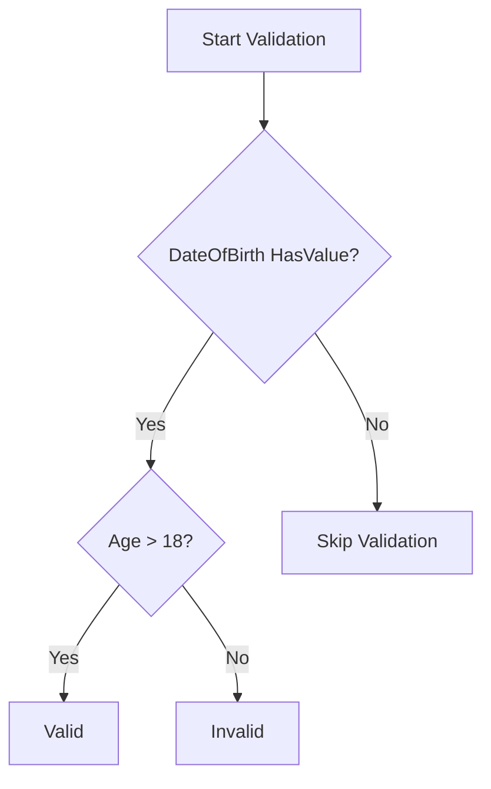
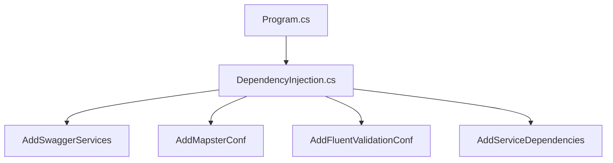

# Advanced FluentValidation Rules and Customization

## Table of Contents
- [Basic String Validations](#basic-string-validations)
- [Custom Messages and Placeholders](#custom-messages-and-placeholders)
- [Complex Date Validations](#complex-date-validations)
- [Best Practices](#best-practices)

## Basic String Validations

### Title Validation
```csharp
public class CreatePollRequestValidator : AbstractValidator<CreatePollRequest>
{
    public CreatePollRequestValidator()
    {
        // Method 1: Separate rules
        RuleFor(x => x.Title)
            .NotEmpty()
            .MinimumLength(3)
            .MaximumLength(100);

        // Method 2: Combined length rule
        RuleFor(x => x.Title)
            .NotEmpty()
            .Length(3, 100);
            
        // Method 3: With description
        RuleFor(x => x.Description)
            .NotEmpty()
            .Length(3, 500);
    }
}
```

## Custom Messages and Placeholders

### Available Placeholders
- `{PropertyName}`: Name of the property being validated
- `{PropertyValue}`: Current value of the property
- `{MinLength}`: Minimum length specified
- `{MaxLength}`: Maximum length specified

```csharp
public class CreatePollRequestValidator : AbstractValidator<CreatePollRequest>
{
    public CreatePollRequestValidator()
    {
        RuleFor(x => x.Title)
            .NotEmpty()
            .WithMessage("Please add a {PropertyName}")
            .Length(3, 100)
            .WithMessage(
                "Title should be at least {MinLength} and maximum {MaxLength}, " +
                "you entered [{PropertyValue}]");
    }
}
```

## Complex Date Validations

### Age Validation Example
```csharp
public class StudentValidator : AbstractValidator<Student>
{
    public StudentValidator()
    {
        RuleFor(x => x.DateOfBirth)
            .Must(BeMoreThan18Years)
            .When(x => x.DateOfBirth.HasValue)
            .WithMessage(
                "{PropertyName} is invalid, age should be 18 years at least");
    }

    private bool BeMoreThan18Years(DateTime? dateOfBirth)
    {
        return DateTime.Today > dateOfBirth!.Value.AddYears(18);
    }
}
```

### Validation Flow


## Best Practices

1. **Separate Complex Logic**
```csharp
public class StudentValidator : AbstractValidator<Student>
{
    public StudentValidator()
    {
        ApplyDateOfBirthRules();
        ApplyNameRules();
    }

    private void ApplyDateOfBirthRules()
    {
        RuleFor(x => x.DateOfBirth)
            .Must(BeMoreThan18Years)
            .When(x => x.DateOfBirth.HasValue)
            .WithMessage(GetAgeErrorMessage());
    }

    private void ApplyNameRules()
    {
        RuleFor(x => x.FirstName)
            .NotEmpty()
            .Length(2, 50);
    }

    private bool BeMoreThan18Years(DateTime? date)
    {
        return DateTime.Today > date!.Value.AddYears(18);
    }

    private string GetAgeErrorMessage()
    {
        return "{PropertyName} is invalid, age should be 18 years at least";
    }
}
```

2. **Conditional Validation**
```csharp
RuleFor(x => x.DateOfBirth)
    .Must(BeMoreThan18Years)
    .When(x => x.DateOfBirth.HasValue)
    .WithMessage("{PropertyName} must indicate an age of at least 18 years");
```

3. **Custom Error Messages**
```csharp
public static class ValidationMessages
{
    public const string Required = "Please provide a {PropertyName}";
    public const string LengthError = 
        "{PropertyName} must be between {MinLength} and {MaxLength} characters";
    public const string AgeError = 
        "Age must be at least 18 years (entered date: {PropertyValue})";
}

public class CreatePollRequestValidator : AbstractValidator<CreatePollRequest>
{
    public CreatePollRequestValidator()
    {
        RuleFor(x => x.Title)
            .NotEmpty()
            .WithMessage(ValidationMessages.Required)
            .Length(3, 100)
            .WithMessage(ValidationMessages.LengthError);
    }
}
```

4. **Reusable Validation Rules**
```csharp
public static class ValidationRules
{
    public static IRuleBuilderOptions<T, string> StandardStringLength<T>(
        this IRuleBuilder<T, string> ruleBuilder)
    {
        return ruleBuilder
            .NotEmpty()
            .Length(3, 100)
            .WithMessage("Length must be between 3 and 100 characters");
    }
}

public class CreatePollRequestValidator : AbstractValidator<CreatePollRequest>
{
    public CreatePollRequestValidator()
    {
        RuleFor(x => x.Title).StandardStringLength();
        RuleFor(x => x.Description).StandardStringLength();
    }
}
```

These implementations provide a clean, maintainable way to implement complex validation rules while keeping the code organized and reusable.


# Organizing Service Registration in .NET Core APIs

## Table of Contents
- [Introduction](#introduction)
- [Code Organization](#code-organization)
- [Implementation Details](#implementation-details)
- [Best Practices](#best-practices)

## Introduction

As applications grow, service registration in Program.cs can become unwieldy. A better approach is to organize these registrations into dedicated extension methods.



## Code Organization

### Project Structure
```
YourApi/
├── DependencyInjection.cs
├── Program.cs
└── Extensions/
    ├── SwaggerExtensions.cs
    ├── MapsterExtensions.cs
    └── ValidationExtensions.cs
```

## Implementation Details

### DependencyInjection Class
```csharp
public static class DependencyInjection
{
    public static IServiceCollection AddDependencies(
        this IServiceCollection services)
    {
        services.AddControllers();
        
        services
            .AddSwaggerServices()
            .AddMapsterConf()
            .AddFluentValidationConf();
            
        services.AddScoped<IPollService, PollService>();
        
        return services;
    }

    private static IServiceCollection AddSwaggerServices(
        this IServiceCollection services)
    {
        services.AddEndpointsApiExplorer();
        services.AddSwaggerGen();
        
        return services;
    }

    private static IServiceCollection AddMapsterConf(
        this IServiceCollection services)
    {
        var mappingConfig = TypeAdapterConfig.GlobalSettings;
        mappingConfig.Scan(Assembly.GetExecutingAssembly());
        
        services.AddSingleton<IMapper>(
            new Mapper(mappingConfig));
            
        return services;
    }

    private static IServiceCollection AddFluentValidationConf(
        this IServiceCollection services)
    {
        services
            .AddFluentValidationAutoValidation()
            .AddValidatorsFromAssembly(
                Assembly.GetExecutingAssembly());
                
        return services;
    }
}
```

### Clean Program.cs
```csharp
var builder = WebApplication.CreateBuilder(args);

// All service registrations in one clean line
builder.Services.AddDependencies();

var app = builder.Build();

// ... rest of configuration
```

## Best Practices

1. **Modular Organization**
```csharp
public static class DependencyInjection
{
    public static IServiceCollection AddDependencies(
        this IServiceCollection services)
    {
        return services
            .AddApiServices()
            .AddExternalServices()
            .AddValidationServices()
            .AddInfrastructureServices();
    }

    private static IServiceCollection AddApiServices(
        this IServiceCollection services)
    {
        services.AddControllers();
        services.AddEndpointsApiExplorer();
        return services;
    }

    private static IServiceCollection AddExternalServices(
        this IServiceCollection services)
    {
        services.AddSwaggerServices();
        services.AddMapsterConf();
        return services;
    }

    // ... other service groups
}
```

2. **Service Lifetime Management**
```csharp
private static IServiceCollection AddInfrastructureServices(
    this IServiceCollection services)
{
    // Singleton services
    services.AddSingleton<IMapper>();
    
    // Scoped services
    services.AddScoped<IPollService, PollService>();
    
    // Transient services
    services.AddTransient<IValidator>();
    
    return services;
}
```


## Benefits

| Benefit | Description |
|---------|-------------|
| Maintainability | Each service registration is in a logical location |
| Readability | Clear organization makes code easier to understand |
| Testability | Services can be registered independently for testing |
| Scalability | Easy to add new services without cluttering Program.cs |

## Extension Method Chain Pattern
```csharp
public static IServiceCollection AddServices(
    this IServiceCollection services)
{
    return services
        .AddAuthentication()
        .AddAuthorization()
        .AddSwagger()
        .AddMapster()
        .AddValidation()
        .AddBusinessServices();
}
```

This organization pattern provides:
- Clear separation of concerns
- Easy maintenance
- Better readability
- Simple extensibility
- Improved testability

The code remains clean and organized as the application grows, making it easier to maintain and understand the service registration process.
