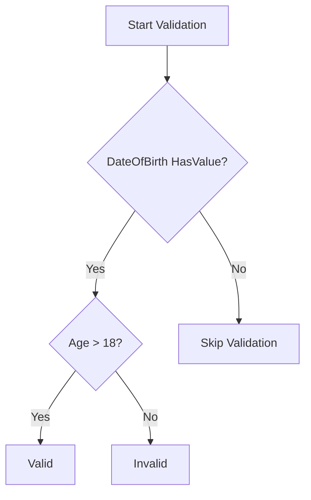

# Advanced FluentValidation Rules and Customization

## Table of Contents
- [Basic String Validations](#basic-string-validations)
- [Custom Messages and Placeholders](#custom-messages-and-placeholders)
- [Complex Date Validations](#complex-date-validations)
- [Best Practices](#best-practices)

## Basic String Validations

### Title Validation
```csharp
public class CreatePollRequestValidator : AbstractValidator<CreatePollRequest>
{
    public CreatePollRequestValidator()
    {
        // Method 1: Separate rules
        RuleFor(x => x.Title)
            .NotEmpty()
            .MinimumLength(3)
            .MaximumLength(100);

        // Method 2: Combined length rule
        RuleFor(x => x.Title)
            .NotEmpty()
            .Length(3, 100);
            
        // Method 3: With description
        RuleFor(x => x.Description)
            .NotEmpty()
            .Length(3, 500);
    }
}
```

## Custom Messages and Placeholders

### Available Placeholders
- `{PropertyName}`: Name of the property being validated
- `{PropertyValue}`: Current value of the property
- `{MinLength}`: Minimum length specified
- `{MaxLength}`: Maximum length specified

```csharp
public class CreatePollRequestValidator : AbstractValidator<CreatePollRequest>
{
    public CreatePollRequestValidator()
    {
        RuleFor(x => x.Title)
            .NotEmpty()
            .WithMessage("Please add a {PropertyName}")
            .Length(3, 100)
            .WithMessage(
                "Title should be at least {MinLength} and maximum {MaxLength}, " +
                "you entered [{PropertyValue}]");
    }
}
```

## Complex Date Validations

### Age Validation Example
```csharp
public class StudentValidator : AbstractValidator<Student>
{
    public StudentValidator()
    {
        RuleFor(x => x.DateOfBirth)
            .Must(BeMoreThan18Years)
            .When(x => x.DateOfBirth.HasValue)
            .WithMessage(
                "{PropertyName} is invalid, age should be 18 years at least");
    }

    private bool BeMoreThan18Years(DateTime? dateOfBirth)
    {
        return DateTime.Today > dateOfBirth!.Value.AddYears(18);
    }
}
```

### Validation Flow


## Best Practices

1. **Separate Complex Logic**
```csharp
public class StudentValidator : AbstractValidator<Student>
{
    public StudentValidator()
    {
        ApplyDateOfBirthRules();
        ApplyNameRules();
    }

    private void ApplyDateOfBirthRules()
    {
        RuleFor(x => x.DateOfBirth)
            .Must(BeMoreThan18Years)
            .When(x => x.DateOfBirth.HasValue)
            .WithMessage(GetAgeErrorMessage());
    }

    private void ApplyNameRules()
    {
        RuleFor(x => x.FirstName)
            .NotEmpty()
            .Length(2, 50);
    }

    private bool BeMoreThan18Years(DateTime? date)
    {
        return DateTime.Today > date!.Value.AddYears(18);
    }

    private string GetAgeErrorMessage()
    {
        return "{PropertyName} is invalid, age should be 18 years at least";
    }
}
```

2. **Conditional Validation**
```csharp
RuleFor(x => x.DateOfBirth)
    .Must(BeMoreThan18Years)
    .When(x => x.DateOfBirth.HasValue)
    .WithMessage("{PropertyName} must indicate an age of at least 18 years");
```

3. **Custom Error Messages**
```csharp
public static class ValidationMessages
{
    public const string Required = "Please provide a {PropertyName}";
    public const string LengthError = 
        "{PropertyName} must be between {MinLength} and {MaxLength} characters";
    public const string AgeError = 
        "Age must be at least 18 years (entered date: {PropertyValue})";
}

public class CreatePollRequestValidator : AbstractValidator<CreatePollRequest>
{
    public CreatePollRequestValidator()
    {
        RuleFor(x => x.Title)
            .NotEmpty()
            .WithMessage(ValidationMessages.Required)
            .Length(3, 100)
            .WithMessage(ValidationMessages.LengthError);
    }
}
```

4. **Reusable Validation Rules**
```csharp
public static class ValidationRules
{
    public static IRuleBuilderOptions<T, string> StandardStringLength<T>(
        this IRuleBuilder<T, string> ruleBuilder)
    {
        return ruleBuilder
            .NotEmpty()
            .Length(3, 100)
            .WithMessage("Length must be between 3 and 100 characters");
    }
}

public class CreatePollRequestValidator : AbstractValidator<CreatePollRequest>
{
    public CreatePollRequestValidator()
    {
        RuleFor(x => x.Title).StandardStringLength();
        RuleFor(x => x.Description).StandardStringLength();
    }
}
```

These implementations provide a clean, maintainable way to implement complex validation rules while keeping the code organized and reusable.
